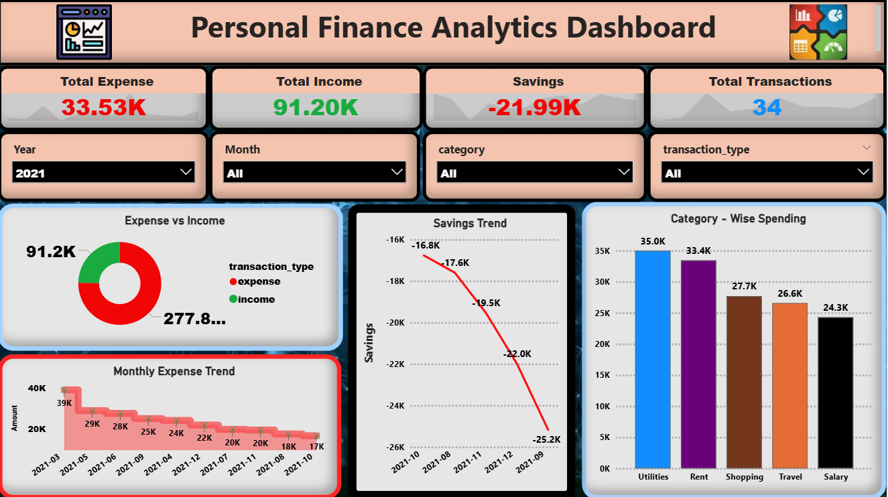

# 📊 Personal Finance Analytics  
(End-to-End Data Analytics Project)

---

## 📌 Project Overview
This project analyzes *personal financial transactions* to understand spending behavior, expense trends, and savings patterns.  
The goal is to transform raw financial data into *actionable insights* using *Python, SQL, and Power BI*.

The project demonstrates a *complete data analytics workflow*:
- Data cleaning & feature engineering (Python)
- Data modeling & querying (MySQL)
- Interactive dashboard creation (Power BI)

---

## 🎯 Business Problem
Managing personal finances becomes difficult without clear visibility into:
- Where money is being spent
- Monthly expense trends
- High-impact spending categories
- Overspending months

This project answers:
- Which month had the highest expenses?
- What are the top spending categories?
- How do expenses change month-over-month?
- Are there months with negative savings?

---

## 🛠 Tools & Technologies
- *Python*: Pandas, NumPy, Matplotlib
- *SQL*: MySQL
- *Power BI*: Data modeling & dashboarding
- *Jupyter Notebook*: Data cleaning & EDA
- *GitHub*: Version control & project hosting

---


## 📂 Project Structure

```
personal-finance-analytics/
│
├── sql/
│   └── finance_analysis.sql
│
├── notebooks/
│   └── finance_analysis.ipynb
│
├── data/
│   ├── raw/
│   │   └── personal_finance.csv
│   ├── cleaned_finance.csv
│   └── cleaned_finance_mysql.csv
│
├── powerbi/
│   └── personal_finance_dashboard.pbix
│
├── screenshots/
│   └── dashboard_overview.png
│
└── README.md
```

---

## 🔄 Data Pipeline
1. *Raw Data Ingestion*
   - Imported raw CSV containing transaction-level data

2. *Data Cleaning (Python)*
   - Handled missing values
   - Standardized categories
   - Created derived columns:
     - txn_year
     - txn_month
     - years_month
     - abs_amount

3. *Database Storage (MySQL)*
   - Designed relational table
   - Loaded cleaned data into MySQL
   - Performed aggregations using SQL

4. *Visualization (Power BI)*
   - Connected Power BI to MySQL
   - Built KPIs & interactive visuals


---

## 📓 Python Analysis
- Missing value handling
- Date feature extraction
- Expense normalization
- Exploratory data analysis with visualizations

   ---

  
## 📊 Key SQL Analysis
- Monthly total expenses
- Month-over-month expense growth
- Top spending categories
- Yearly expense comparison

(SQL queries available in sql/finance_analysis.sql)

---

## 📈 Power BI Dashboard Features
- *Total Expense KPI*
- *Monthly Expense Trend*
- *Category-wise Spending Breakdown*
- *Year & Month Filters*
- *Overspending Detection*

## 📊 Power BI Dashboard Preview



## 🔍 Key Insights
- Certain months show *expense spikes*, indicating seasonal spending
- *Top 3 categories* contribute the majority of total expenses
- Month-over-month analysis highlights *rapid increases in spending*
- Some months indicate *negative savings*, signaling overspending

---

## 🚀 Learning Outcomes
- Built an *end-to-end analytics project*
- Strengthened *Python data cleaning & EDA skills*
- Applied *SQL for analytical querying*
- Designed *business-focused Power BI dashboards*
- Practiced *professional GitHub project structuring*

---

## 👤 Author
*Rituraj Singh*  
Aspiring Data Analyst  
📧 Open to Data Analyst & Business Analyst roles

---
---


